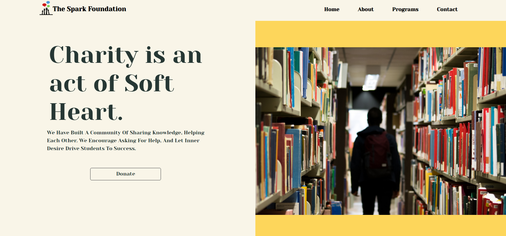

# Donation App designed for The Spark Foundation

This website is for the Spark Foundation which includes integration of payment gateways using razorpay.
An payment page is added in the website which enables user to add the amount they wanr to donate and then choose any payment method including UPI -( Google pay, PayTM, phonePe), cards, UPI/QR, Netbanking and ICICI pay later.

One the payment is done an e-reciept will be generated and sent to the user immediately after the payment on his entered email address and the e-Recipet contains the amount payed by the user. Also a summary of received payemnts is sent to the foundation at the end of the day.

